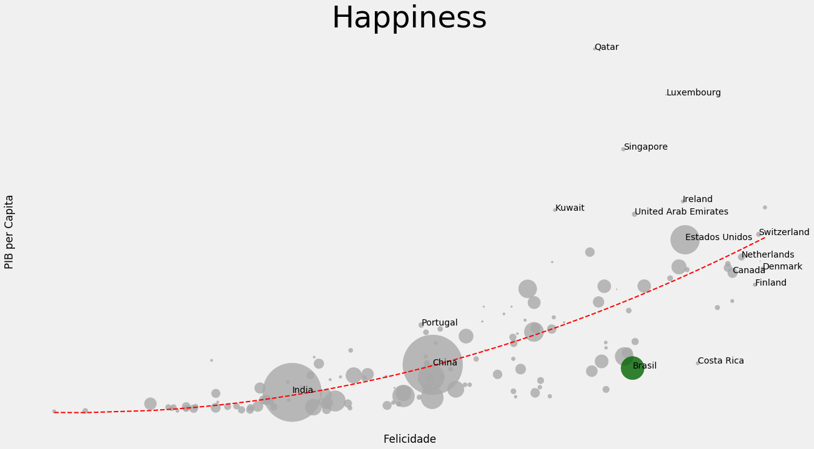

# Happines vs GDP/capita

A visual relation between GDP per capita and Hapinness

p.s.: I no longer have the datasets I used to generate the graph below.  
I may soon work on an update here!  

## Inspiration
https://en.wikipedia.org/wiki/List_of_countries_by_GDP_(PPP)_per_capita
 
https://en.wikipedia.org/wiki/World_Happiness_Report

## How does it look like?

## Dependencies
matplotlib.pyplot  
pandas  
numpy

## Further work
This is a snapshot of a given moment.
 
What about making this graph as a GIF showing the movement of countries year after year?

